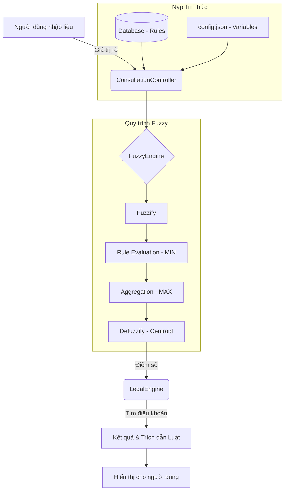

# KIẾN TRÚC SUY DIỄN VÀ LUỒNG DỮ LIỆU HỆ THỐNG

Tài liệu này mô tả chi tiết cách hệ thống nạp dữ liệu từ tri thức chuyên gia (Luật) và thực hiện suy diễn mờ để đưa ra tư vấn pháp lý.

---

## 1. QUÁ TRÌNH NẠP DỮ LIỆU (DATA LOADING)

Quá trình này xảy ra khi người dùng bắt đầu một phiên tư vấn cho một Module cụ thể (ví dụ: Thuế đất đai).

### Bước 1: Nạp cấu hình biến mờ (Tĩnh)
- **File:** `modules/[module_name]/config.json`
- **Hàm thực hiện:** `FuzzyEngine.load_config(config)`
- **Nội dung:** 
    - Định nghĩa các biến đầu vào (ví dụ: `dien_tich`, `loai_dat`).
    - Định nghĩa các hàm liên thuộc (Membership Functions) như `Thấp`, `Trung bình`, `Cao`.
    - Thiết lập các thông số hình học [a, b, c] cho Tam giác hoặc [a, b, c, d] cho Hình thang.

### Bước 2: Nạp tập luật suy diễn (Động)
- **File:** `models/rule.py` & `expert_system.db`
- **Hàm thực hiện:** `Rule.get_by_module(module_name)` sau đó nạp vào `FuzzyEngine.load_rules_from_db(rule_models)`.
- **Nội dung:** 
    - Lấy các luật thật từ Cơ sở dữ liệu SQLite.
    - Cấu trúc luật: `IF (Biến A là Tập X) AND (Biến B là Tập Y) THEN (Kết luận là Tập Z)`.
    - Mỗi luật liên kết với một ID điều khoản pháp lý (`legal_article_id`).

---

## 2. QUY TRÌNH SUY DIỄN CHI TIẾT (INFERENCE PROCESS)

Khi người dùng nhấn nút "Chạy tư vấn", luồng xử lý sẽ đi qua 3 lớp chính:

### Lớp 1: Giao diện (Views)
- **File:** `views/consultation_view.py`
- **Hàm:** `_on_run()`
- **Nhiệm vụ:** Thu thập giá trị rõ (Crisp input) từ các thanh trượt/combo box và gửi đến Controller.

### Lớp 2: Điều phối (Controllers)
- **File:** `controllers/consultation_controller.py`
- **Hàm:** `run_consultation(module_name, inputs)`
- **Nhiệm vụ:**
    1. Khởi tạo `FuzzyEngine`.
    2. Nạp Config và Rules (như mô tả ở phần 1).
    3. Gọi `fuzzy.run(inputs)` để lấy điểm số mờ.
    4. Gọi `LegalEngine.get_articles_for_rules()` để lấy trích dẫn luật dựa trên các luật đã khớp.

### Lớp 3: Động cơ cốt lõi (Engines)
Đây là nơi thực hiện tính toán tại `engines/fuzzy_engine.py`. Quy trình đi qua 4 bước toán học:

#### Bước 1: Mờ hóa (Fuzzification) - Tính độ liên thuộc (mu)
Hệ thống sử dụng hàm `MembershipFunction.evaluate(x)` để tính xem giá trị thực `x` thuộc về một tập mờ bao nhiêu phần trăm (từ 0 đến 1).

*   **Hàm Tam giác (Triangular) [a, b, c]:**
    - Nếu **x <= a** hoặc **x >= c**: mu = 0 (Không thuộc)
    - Nếu **x = b**: mu = 1 (Thuộc hoàn toàn)
    - Nếu **a < x < b**: mu = (x - a) / (b - a) (Đang tăng dần)
    - Nếu **b < x < c**: mu = (c - x) / (c - b) (Đang giảm dần)

*   **Hàm Hình thang (Trapezoidal) [a, b, c, d]:**
    - Nếu **x <= a** hoặc **x >= d**: mu = 0
    - Nếu **b <= x <= c**: mu = 1 (Thuộc hoàn toàn ở đoạn giữa)
    - Nếu **a < x < b**: mu = (x - a) / (b - a) (Đang tăng)
    - Nếu **c < x < d**: mu = (d - x) / (d - c) (Đang giảm)

#### Bước 2: Đánh giá luật (Rule Evaluation) - Tìm độ kích hoạt (alpha)
Với mỗi luật, hệ thống lấy giá trị mu **nhỏ nhất** (MIN) của các điều kiện.
- Ví dụ luật: NẾU (Diện tích là Lớn: 0.8) VÀ (Vị trí là Đẹp: 0.5)
- => Độ kích hoạt luật **alpha = 0.5** (Lấy con số nhỏ nhất).

#### Bước 3: Tổng hợp (Aggregation)
1.  **Cắt ngọn:** Tập kết quả (ví dụ: "Bồi thường Cao") sẽ bị giới hạn độ cao tối đa là 0.5 (alpha).
2.  **Hợp nhất:** Hệ thống chồng tất cả các hình học của các luật lên nhau và lấy phần bao bên ngoài (giá trị lớn nhất - MAX).

#### Bước 4: Giải mờ (Defuzzification) - Tính điểm cuối cùng
Hệ thống tính **Trọng tâm** của hình học tổng hợp ở Bước 3.
- **Công thức đơn giản:** Điểm = (Tổng của [Giá trị x * Độ cao tại x]) / (Tổng các độ cao)
- **Ý nghĩa:** Kết quả là "điểm cân bằng" của toàn bộ các luật. Nếu các luật "nặng" chiếm ưu thế, trọng tâm sẽ lệch về phía điểm cao (80-100), nếu các luật "nhẹ" chiếm ưu thế, trọng tâm sẽ lệch về phía điểm thấp (0-20).

---

## 3. SƠ ĐỒ LUỒNG DỮ LIỆU (FLOWCHART)

---

## 4. VÍ DỤ THỰC TẾ
Nếu hệ thống có luật: `IF (Diện tích là Lớn) AND (Vị trí là Đẹp) THEN (Mức bồi thường là Cao)`

1. **Nạp dữ liệu:** Hệ thống nạp luật này từ DB và định nghĩa "Lớn", "Đẹp", "Cao" từ file json.
2. **Mờ hóa:** Diện tích 100m2 $\rightarrow$ "Lớn" đạt 0.9. Vị trí loại 1 $\rightarrow$ "Đẹp" đạt 1.0.
3. **Suy diễn:** Độ kích hoạt = `min(0.9, 1.0) = 0.9`.
4. **Kết quả:** Tập mờ "Cao" sẽ bị cắt ở mức 0.9 và đưa vào tính toán trọng tâm để ra số tiền bồi thường cụ thể.
