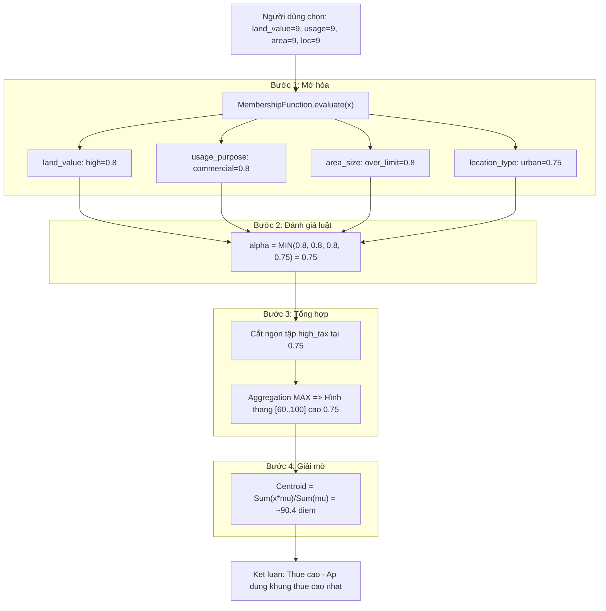

# KIẾN TRÚC SUY DIỄN VÀ LUỒNG DỮ LIỆU HỆ THỐNG

---

## PHẦN I: LÝ THUYẾT LOGIC MỜ (Fuzzy Logic)

### 1. Logic Mờ là gì?

Logic Mờ (Fuzzy Logic) là một dạng logic toán học cho phép một phần tử **vừa thuộc vừa không thuộc** một tập hợp ở các mức độ khác nhau, thay vì chỉ có hai trạng thái cứng nhắc là "hoàn toàn thuộc" (1) hoặc "hoàn toàn không thuộc" (0) như logic cổ điển.

**Ví dụ trực quan:**
- Logic cổ điển: Một mảnh đất hoặc là "đắt" HOẶC là "rẻ" (không có vùng xám).
- Logic Mờ: Một mảnh đất có thể vừa "hơi đắt" (0.6) vừa "hơi trung bình" (0.4) cùng một lúc.

---

### 2. Các Định Nghĩa Cốt Lõi

#### 2.1. Tập Mờ (Fuzzy Set)
Là một tập hợp trong đó mỗi phần tử có một **độ liên thuộc (membership degree)** nằm trong khoảng [0, 1].
- **0**: Hoàn toàn không thuộc tập.
- **1**: Thuộc hoàn toàn vào tập.
- **0 < mu < 1**: Thuộc một phần (mức độ mờ).

Trong hệ thống, các tập mờ được định nghĩa trong file `config.json` của từng module, ví dụ: tập "Cao", tập "Trung bình", tập "Thấp".

#### 2.2. Hàm Liên Thuộc (Membership Function - MF)
Là hàm toán học xác định độ liên thuộc `mu(x)` của một giá trị thực `x` vào một tập mờ. Hệ thống hỗ trợ 2 dạng hàm:

**a) Hàm Tam giác (Triangular) - params: [a, b, c]**
```
Hình dạng:      /\
               /  \
              /    \
_____________/      \____________
             a   b   c
```
- `a`: Điểm bắt đầu tăng (mu=0)
- `b`: Đỉnh tam giác (mu=1)
- `c`: Điểm kết thúc giảm (mu=0)
- Công thức:
  - x <= a hoặc x >= c  =>  mu = 0
  - a < x < b           =>  mu = (x - a) / (b - a)   [tăng tuyến tính]
  - x = b               =>  mu = 1
  - b < x < c           =>  mu = (c - x) / (c - b)   [giảm tuyến tính]

**b) Hàm Hình thang (Trapezoidal) - params: [a, b, c, d]**
```
Hình dạng:     ________
              /        \
             /          \
____________/            \________
            a   b    c   d
```
- `a`: Điểm bắt đầu tăng (mu=0)
- `b`: Bắt đầu vùng đỉnh (mu=1)
- `c`: Kết thúc vùng đỉnh (mu=1)
- `d`: Điểm kết thúc giảm (mu=0)
- Công thức:
  - x <= a hoặc x >= d  =>  mu = 0
  - a < x < b           =>  mu = (x - a) / (b - a)   [tăng]
  - b <= x <= c         =>  mu = 1                    [vùng đỉnh phẳng]
  - c < x < d           =>  mu = (d - x) / (d - c)   [giảm]

> Hình thang được dùng khi một tập mờ có một "vùng chắc chắn" rộng, không chỉ là một điểm đỉnh. Ví dụ: "Trung bình" có thể là [20, 40, 60, 80] nghĩa là từ 40 đến 60 đều là "Trung bình hoàn toàn".

#### 2.3. Biến Ngôn Ngữ (Linguistic Variable)
Là biến có các giá trị được biểu diễn bằng ngôn ngữ tự nhiên thay vì con số. Mỗi giá trị ngôn ngữ tương ứng với một tập mờ.

Ví dụ: Biến "Giá trị đất" có các giá trị ngôn ngữ: **"Thấp"**, **"Trung bình"**, **"Cao"** — mỗi cái là một tập mờ riêng.

#### 2.4. Quy Tắc Mờ (Fuzzy Rule)
Là luật IF-THEN kết nối các biến đầu vào với đầu ra:
```
IF (land_value là "Cao") AND (location_type là "Đô thị")
THEN (tax_rate là "Thuế cao")
```
Trong hệ thống, các quy tắc này được lưu trong Cơ sở dữ liệu SQLite và nạp động qua `Rule.get_by_module()`.

#### 2.5. Mờ hóa (Fuzzification)
Quá trình chuyển đổi giá trị thực (crisp input) đầu vào thành các độ liên thuộc mờ bằng cách áp dụng hàm liên thuộc.
- **Đầu vào:** Giá trị số (ví dụ: x = 9)
- **Đầu ra:** Tập các cặp (tập mờ, độ liên thuộc) (ví dụ: {Thấp: 0.0, Trung bình: 0.0, Cao: 0.8})

#### 2.6. Suy Diễn Mờ Mamdani
Phương pháp suy diễn được hệ thống sử dụng, gồm 2 phần:
- **Toán tử AND (MIN):** Độ kích hoạt của một luật = giá trị nhỏ nhất trong các độ liên thuộc của các điều kiện đầu vào.
- **Cắt ngọn (Clipping):** Hàm liên thuộc đầu ra bị cắt ngang tại mức độ kích hoạt của luật đó.

#### 2.7. Tổng Hợp (Aggregation)
Gộp kết quả của nhiều luật đã kích hoạt thành một hình học mờ tổng hợp duy nhất bằng toán tử MAX (lấy giá trị lớn nhất tại mỗi điểm).

#### 2.8. Giải Mờ (Defuzzification)
Quá trình chuyển đổi hình học mờ tổng hợp thành một con số thực (điểm số cuối cùng). Phương pháp Trọng tâm (Centroid):
```
Diem = Sum(x_i * mu_i) / Sum(mu_i)
```
Tìm "điểm cân bằng" của hình học, tương tự như tính trọng tâm vật lý của một vật thể.

---

## PHẦN II: ÁP DỤNG VÀO HỆ THỐNG

---

## VÍ DỤ TÍNH TOÁN THỰC TẾ - MODULE THUẾ ĐẤT ĐAI

### TÌNH HUỐNG GIẢ ĐỊNH
Người dùng cần tư vấn thuế cho một mảnh đất với các thông số:

| Biến đầu vào        | Người dùng chọn                | Giá trị (x) |
|:--------------------|:-------------------------------|:------------|
| Giá trị đất         | Cao (Mặt tiền, trung tâm đô thị) | **x = 9**   |
| Mục đích sử dụng    | Đất thương mại, dịch vụ         | **x = 9**   |
| Diện tích đất       | Vượt hạn mức giao đất           | **x = 9**   |
| Vị trí khu đất      | Đô thị, thành phố               | **x = 9**   |

---

## BƯỚC 1: MỜ HÓA (Fuzzification)
Hàm `MembershipFunction.evaluate(x)` được gọi cho từng biến, từng tập mờ.

### 1.1 - Biến "land_value" (Giá trị đất) - x = 9

Các tập mờ được định nghĩa trong `modules/tax/config.json`:
```
"low"    (Thấp)       : triangular [a=0,  b=0,  c=5]
"medium" (Trung bình) : triangular [a=2,  b=5,  c=8]
"high"   (Cao)        : triangular [a=5,  b=10, c=10]
```

**Tính cho tập "low"   [0, 0, 5]:**
- x=9 >= c=5  =>  mu("low") = **0.0**

**Tính cho tập "medium" [2, 5, 8]:**
- x=9 >= c=8  =>  mu("medium") = **0.0**

**Tính cho tập "high"   [5, 10, 10]:**
- Vùng tăng: a < x < b  =>  5 < 9 < 10
- Công thức: mu = (x - a) / (b - a) = (9 - 5) / (10 - 5) = 4/5 = **0.8**

> KẾT QUẢ land_value=9: low=0.0, medium=0.0, HIGH=0.8

---

### 1.2 - Biến "usage_purpose" (Mục đích sử dụng) - x = 9

```
"residential" (Đất ở/Nông nghiệp)    : triangular [a=0, b=0,  c=5]
"commercial"  (Thương mại/Dịch vụ)   : triangular [a=5, b=10, c=10]
```

**Tính cho tập "residential" [0, 0, 5]:**
- x=9 >= c=5  =>  mu = **0.0**

**Tính cho tập "commercial"  [5, 10, 10]:**
- Vùng tăng: 5 < 9 < 10
- mu = (9 - 5) / (10 - 5) = 4/5 = **0.8**

> KẾT QUẢ usage_purpose=9: residential=0.0, COMMERCIAL=0.8

---

### 1.3 - Biến "area_size" (Diện tích đất) - x = 9

```
"within_limit" (Trong hạn mức)  : triangular [a=0, b=0,  c=5]
"over_limit"   (Vượt hạn mức)   : triangular [a=5, b=10, c=10]
```

**Tính "over_limit" [5, 10, 10]:**
- Vùng tăng: 5 < 9 < 10
- mu = (9 - 5) / (10 - 5) = **0.8**

> KẾT QUẢ area_size=9: within_limit=0.0, OVER_LIMIT=0.8

---

### 1.4 - Biến "location_type" (Vị trí khu đất) - x = 9

```
"remote" (Vùng sâu xa)  : triangular [a=0, b=0, c=4]
"rural"  (Nông thôn)    : triangular [a=2, b=5, c=8]
"urban"  (Đô thị)       : triangular [a=6, b=10, c=10]
```

**Tính "urban"  [6, 10, 10]:**
- Vùng tăng: 6 < 9 < 10
- mu = (9 - 6) / (10 - 6) = 3/4 = **0.75**

> KẾT QUẢ location_type=9: remote=0.0, rural=0.0, URBAN=0.75

---

## BƯỚC 2: ĐÁNH GIÁ LUẬT (Rule Evaluation)
Hàm `FuzzyRule.evaluate(fuzzy_inputs)` - Toán tử AND = lấy giá trị MIN.

Giả sử tập luật trong DB có luật:
```
IF land_value=high AND usage_purpose=commercial AND area_size=over_limit AND location_type=urban
THEN tax_rate = high_tax
```

**Lấy mu của từng điều kiện:**

| Điều kiện                          | Giá trị mu |
|:-----------------------------------|:----------:|
| land_value = "high"                | 0.80       |
| usage_purpose = "commercial"       | 0.80       |
| area_size = "over_limit"           | 0.80       |
| location_type = "urban"            | 0.75       |

**Độ kích hoạt luật (alpha) = MIN(0.80, 0.80, 0.80, 0.75) = 0.75**

---

## BƯỚC 3: TỔNG HỢP (Aggregation)
Hàm `FuzzyEngine.aggregate(rule_activations)`.

**Tập đầu ra "high_tax" được định nghĩa:**
```
"high_tax" (Thuế cao) : triangular [a=60, b=100, c=100]
```
Miền đầu ra: [0, 100], hệ thống lấy mẫu 1000 điểm.

**Quá trình "cắt ngọn" (Clipping) tại alpha=0.75:**

Với mỗi điểm x trong [60, 100], tính mu rồi cắt ngọn:
```
x=60  : mu_high_tax = (60-60)/(100-60) = 0.0  =>  clipped = min(0.0, 0.75) = 0.0
x=70  : mu_high_tax = (70-60)/(100-60) = 0.25 =>  clipped = min(0.25, 0.75) = 0.25
x=80  : mu_high_tax = (80-60)/(100-60) = 0.5  =>  clipped = min(0.5, 0.75)  = 0.50
x=90  : mu_high_tax = (90-60)/(100-60) = 0.75 =>  clipped = min(0.75, 0.75) = 0.75  <-- bị cắt
x=95  : mu_high_tax = (95-60)/(100-60) = 0.875=>  clipped = min(0.875, 0.75)= 0.75  <-- bị cắt
x=100 : mu_high_tax = 1.0                      =>  clipped = min(1.0, 0.75)  = 0.75  <-- bị cắt
```

Hình học kết quả: Thay vì tam giác nhọn [60->100], bây giờ có dạng hình thang bị cắt ngang ở 0.75.

---

## BƯỚC 4: GIẢI MỜ (Defuzzification) - Ra điểm số cuối cùng
Hàm `FuzzyEngine.defuzzify(x, aggregated)`.

**Công thức Trọng tâm:**
```
Diem = Sum(x_i * aggregated_i) / Sum(aggregated_i)
```

Lấy mẫu thô (đơn giản hóa để minh họa):

| x  | aggregated (sau cắt ngọn) | x * aggregated |
|:--:|:-------------------------:|:--------------:|
| 60 | 0.00                      | 0.00           |
| 70 | 0.25                      | 17.50          |
| 80 | 0.50                      | 40.00          |
| 90 | 0.75                      | 67.50          |
| 95 | 0.75                      | 71.25          |
| 100| 0.75                      | 75.00          |
| **Tổng** | **3.00**         | **271.25**     |

**Điểm cuối cùng = 271.25 / 3.00 = ~90.4 điểm**

---

## KẾT LUẬN CUỐI CÙNG

Hệ thống ánh xạ điểm số sang nhận xét:
```
>= 70 điểm  =>  "Thuế cao - Trường hợp đặc biệt, cần nộp đầy đủ theo khung cao nhất"
>= 40 điểm  =>  "Tiêu chuẩn - Áp dụng mức thuế phổ thông"
<  40 điểm  =>  "Ưu đãi/Miễn giảm - Được hưởng chính sách ưu đãi"
```

| Kết quả               | Giá trị                                                    |
|:----------------------|:-----------------------------------------------------------|
| Điểm số               | **~90.4**                                                  |
| Kết luận              | **Thuế cao**                                               |
| Luật áp dụng          | land_value=high + commercial + over_limit + urban          |
| Điều khoản pháp lý    | Được LegalEngine tra cứu từ DB theo `legal_article_id`     |

---

## SƠ ĐỒ LUỒNG DỮ LIỆU


