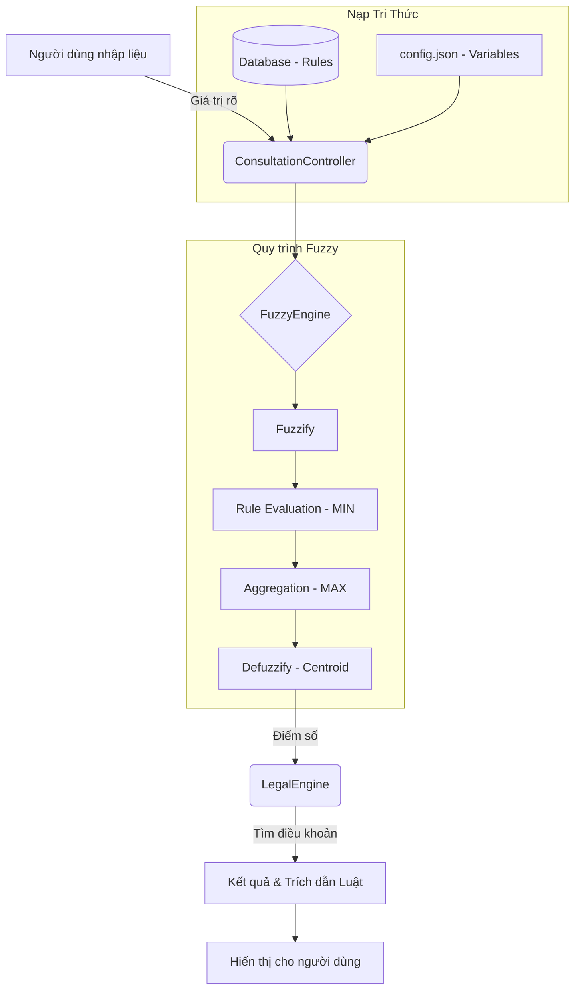

# KIẾN TRÚC SUY DIỄN VÀ LUỒNG DỮ LIỆU HỆ THỐNG

Tài liệu này mô tả chi tiết cách hệ thống nạp dữ liệu từ tri thức chuyên gia (Luật) và thực hiện suy diễn mờ để đưa ra tư vấn pháp lý.

---

## 1. QUÁ TRÌNH NẠP DỮ LIỆU (DATA LOADING)

Quá trình này xảy ra khi người dùng bắt đầu một phiên tư vấn cho một Module cụ thể (ví dụ: Thuế đất đai).

### Bước 1: Nạp cấu hình biến mờ (Tĩnh)
- **File:** `modules/[module_name]/config.json`
- **Hàm thực hiện:** `FuzzyEngine.load_config(config)`
- **Nội dung:** 
    - Định nghĩa các biến đầu vào (ví dụ: `dien_tich`, `loai_dat`).
    - Định nghĩa các hàm liên thuộc (Membership Functions) như `Thấp`, `Trung bình`, `Cao`.
    - Thiết lập các thông số hình học [a, b, c] cho Tam giác hoặc [a, b, c, d] cho Hình thang.

### Bước 2: Nạp tập luật suy diễn (Động)
- **File:** `models/rule.py` & `expert_system.db`
- **Hàm thực hiện:** `Rule.get_by_module(module_name)` sau đó nạp vào `FuzzyEngine.load_rules_from_db(rule_models)`.
- **Nội dung:** 
    - Lấy các luật thật từ Cơ sở dữ liệu SQLite.
    - Cấu trúc luật: `IF (Biến A là Tập X) AND (Biến B là Tập Y) THEN (Kết luận là Tập Z)`.
    - Mỗi luật liên kết với một ID điều khoản pháp lý (`legal_article_id`).

---

## 2. QUY TRÌNH SUY DIỄN CHI TIẾT (INFERENCE PROCESS)

Khi người dùng nhấn nút "Chạy tư vấn", luồng xử lý sẽ đi qua 3 lớp chính:

### Lớp 1: Giao diện (Views)
- **File:** `views/consultation_view.py`
- **Hàm:** `_on_run()`
- **Nhiệm vụ:** Thu thập giá trị rõ (Crisp input) từ các thanh trượt/combo box và gửi đến Controller.

### Lớp 2: Điều phối (Controllers)
- **File:** `controllers/consultation_controller.py`
- **Hàm:** `run_consultation(module_name, inputs)`
- **Nhiệm vụ:**
    1. Khởi tạo `FuzzyEngine`.
    2. Nạp Config và Rules (như mô tả ở phần 1).
    3. Gọi `fuzzy.run(inputs)` để lấy điểm số mờ.
    4. Gọi `LegalEngine.get_articles_for_rules()` để lấy trích dẫn luật dựa trên các luật đã khớp.

### Lớp 3: Động cơ cốt lõi (Engines)
Đây là nơi thực hiện tính toán tại `engines/fuzzy_engine.py`. Quy trình đi qua 4 bước toán học:

#### Bước 1: Mờ hóa (Fuzzification) - Tính độ liên thuộc $\mu$
Hệ thống sử dụng hàm `MembershipFunction.evaluate(x)` để tính độ khớp của giá trị thực `x` vào một tập mờ.

*   **Hàm Tam giác (Triangular) [a, b, c]:**
    $$ \mu(x) = \begin{cases} 0 & x \le a \text{ hoặc } x \ge c \\ \frac{x-a}{b-a} & a < x < b \\ 1 & x = b \\ \frac{c-x}{c-b} & b < x < c \end{cases} $$
    *(Trong code: dòng 36-44 file `fuzzy_engine.py`)*

*   **Hàm Hình thang (Trapezoidal) [a, b, c, d]:**
    $$ \mu(x) = \begin{cases} 0 & x \le a \text{ hoặc } x \ge d \\ \frac{x-a}{b-a} & a < x < b \\ 1 & b \le x \le c \\ \frac{d-x}{d-c} & c < x < d \end{cases} $$
    *(Trong code: dòng 46-55 file `fuzzy_engine.py`)*

#### Bước 2: Đánh giá luật (Rule Evaluation) - Tìm độ kích hoạt $\alpha$
Với mỗi luật, hệ thống lấy giá trị $\mu$ nhỏ nhất của các điều kiện đầu vào (Toán tử AND/MIN).
Ví dụ: Nếu `Diện tích là Lớn (0.8)` AND `Vị trí là Đẹp (0.5)` $\Rightarrow$ Độ kích hoạt luật $\alpha = 0.5$.

#### Bước 3: Tổng hợp (Aggregation) - Hợp nhất các hình học
Hệ thống sử dụng phương pháp **Mamdani**:
1.  **Cắt ngọn (Clipping):** Hàm liên thuộc của kết quả (ví dụ: tập "Cao") sẽ bị cắt ngang tại độ cao $\alpha$.
2.  **Hợp nhất (MAX):** Lấy giá trị lớn nhất của tất cả các hàm đã bị cắt ngọn để tạo ra một hình học tổng hợp duy nhất đại diện cho tất cả các luật đã kích hoạt.

#### Bước 4: Giải mờ (Defuzzification) - Trọng tâm (Centroid)
Đây là bước quan trọng nhất để ra số điểm cuối cùng. Hàm `defuzzify(x, aggregated)` thực hiện tính toán:
$$ \text{Điểm cuối cùng} = \frac{\sum (x_i \cdot \text{aggregated}_i)}{\sum \text{aggregated}_i} $$
*   **Ý nghĩa:** Tìm "trọng tâm" của hình học tổng hợp. Điểm này đại diện cho sự cân bằng của tất cả các ý kiến từ tập luật.
*   **Ví dụ:** Nếu các luật nghiêng về phía "Vi phạm nặng" (điểm cao), hình học sẽ lệch về bên phải, kéo trọng tâm lên mức 80-90 điểm.

---

## 3. SƠ ĐỒ LUỒNG DỮ LIỆU (FLOWCHART)

---

## 4. VÍ DỤ THỰC TẾ
Nếu hệ thống có luật: `IF (Diện tích là Lớn) AND (Vị trí là Đẹp) THEN (Mức bồi thường là Cao)`

1. **Nạp dữ liệu:** Hệ thống nạp luật này từ DB và định nghĩa "Lớn", "Đẹp", "Cao" từ file json.
2. **Mờ hóa:** Diện tích 100m2 $\rightarrow$ "Lớn" đạt 0.9. Vị trí loại 1 $\rightarrow$ "Đẹp" đạt 1.0.
3. **Suy diễn:** Độ kích hoạt = `min(0.9, 1.0) = 0.9`.
4. **Kết quả:** Tập mờ "Cao" sẽ bị cắt ở mức 0.9 và đưa vào tính toán trọng tâm để ra số tiền bồi thường cụ thể.
